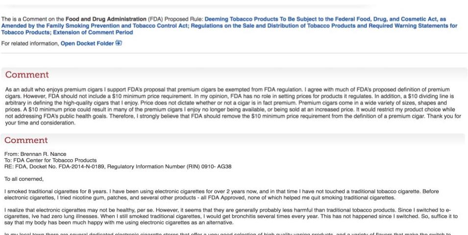
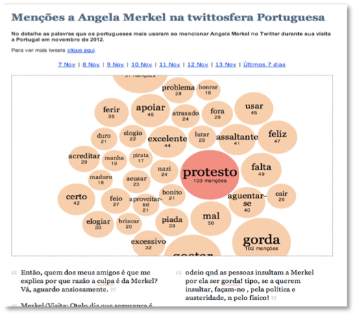
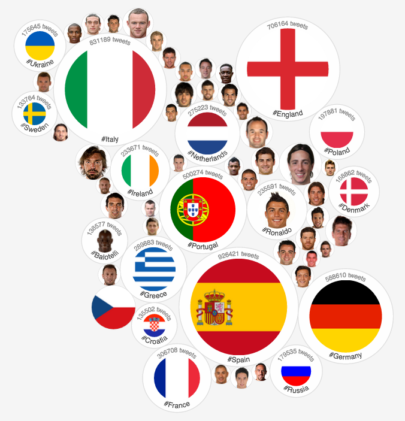
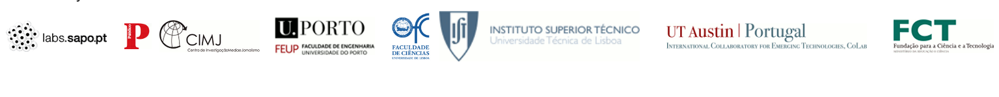

>## Californians Talk HIV: Using Social Media to Get Steps Ahead

Joint project of the [University of California San Diego](https://medschool.ucsd.edu/Pages/default.aspx){:target="_blank"} and the [Johns Hopkins University](https://www.jhu.edu/){:target="_blank"}, aiming to develop methods to extract actionable intelligence from social media platforms to support timely, evidence-based decision making and help public health leaders and advocates stay one step ahead of California’s HIV epidemic.

>## Increasing Citizen Participation in E-Rulemaking by Harnessing Social Media

Joint project of the [University of California San Diego](https://medschool.ucsd.edu/Pages/default.aspx){:target="_blank"} and the [Johns Hopkins University](https://www.jhu.edu/){:target="_blank"}, aiming to increase public participation in the regulatory process by crowdsourcing and extracting actionable feedback regarding government regulations from public social media comments. 

<!-- The goal is to develop a process that can funnel millions of public comments into a clear feedback mechanism to regulators. This process can effectively increase rulemaking participation by passively including millions of citizens and providing unsolicited comments throughout the rulemaking process. As a case-study, we will consider the FDA's recently expanded regulation of tobacco products. -->

<!-- **Specific Aims**
1. Create a comprehensive, constantly updated corpus of public Electronic Nicotine Delivery Systems (ENDS) related comments from Twitter, Reddit and other social media platforms.
2. Automatically identify and characterize social media comments relevant to ENDS’ regulations.
3. Conduct a comparative analysis of relevant comments on regulations.gov with comments derived from our social media analysis to identify areas of overlap and unique insights arising from social media. -->

# Past Projects

>## EXPRESS
**Expression and Recognition of Irony in Multicultural Social Media**

Joint research project funded by FCT Portugal with researchers from [INESC-ID Lisboa](https://www.inesc-id.pt/){:target="_blank"} and the [University of Texas at Austin](https://www.ischool.utexas.edu/){:target="_blank"}, on the automatic analysis of sarcasm and irony in social media.

We developed novel sarcasm detection methods, including [CUE-CNN](https://github.com/samiroid/CUE-CNN){:target="_blank"} --- a deep neural network that automatically learns and exploits representations for both the author and contents of a post to make contexualized inferences over highly ambiguous content.

**Press Coverage**

[New Scientist](https://www.newscientist.com/article/2100007-ai-reads-your-tweets-and-spots-when-youre-being-sarcastic/) | [Digital Trends](https://www.digitaltrends.com/cool-tech/twitter-sarcasm-det-ection-tweets/) | [Tech Crunch](https://techcrunch.com/2016/08/04/this-neural-network-tries-to-tell-if-youre-being-sarcastic-online/) | [Sky News](https://news.sky.com/story/oh-great-now-computers-can-spot-sarcasm-10523711) | [Daily Mail](https://www.dailymail.co.uk/sciencetech/article-3725458/Oh-really-Scientists-create-neural-network-spot-sarcasm-Twitter.html) | [Sapo](https://sapo24.blogs.sapo.pt/eles-querem-tornar-o-sarcasmo-online-113129) |
[Tech Xplore](https://techxplore.com/news/2016-08-deep-neural-network-approach-sarcasm.html) | [Improbable Research](https://www.improbable.com/2016/08/11/a-sarcastic-tweet-detection-algorithm/) | [Evening Standard](https://www.standard.co.uk/news/sarcasm-detector-invented-for-social-media-yeah-right-a3313121.html) | [Euclid](https://euclid.ee.duth.gr/news/ai-reads-your-tweets-and-spots-when-youre-being-sarcastic-acm-technews/) | [Vocativ](https://www.vocativ.com/354921/the-endless-quest-to-understand-sarcasm-on-the-internet/index.html) |

>## POPSTAR <a href="http://www.popstar.pt"><a>
**Public Opinion and Sentiment Tracking, Analysis, and Research**

Interdisciplinary R&D project funded by FCT Portugal with researchers from with [INESC-ID Lisboa](https://www.inesc-id.pt/){:target="_blank"}, [Instituto de Ciências Sociais](https://www.ics.ulisboa.pt/en){:target="_blank"}, [Universidade do Minho](http://www.nipe.eeg.uminho.pt/Default.aspx?lang=en-US){:target="_blank"}, [Faculdade de Engenharia da Universidade do Porto](https://sigarra.up.pt/feup/en/web_page.Inicial){:target="_blank"}, on using conventional and social media to measure and track public opinion about political entities.

We built a political opinion mining for social media to measure the popularity and attitudes about Portuguese political entities over time. The indicators produced by the system were aligned with traditional polls and published in quasi-realtime (i.e. updated daily) in a publicly available [dashboard](http://www.popstar.pt), which has been used by political scientists to conduct new studies on public opinion. 

See the project's (archived) [webpage](https://arquivo.pt/wayback/20161102032746/http://dmir.inesc-id.pt/project/POPSTAR) for more details and the respective [scoop.it](https://www.scoop.it/t/popstar-news) for some of the related press coverage. 

>## REACTION 
**Retrieval, Extraction and Aggregation Computing Technology for Integrating and Organizing News**

Interdisciplinary R&D project, funded by the [CoLab, UT Austin - Portugal](http://utaustinportugal.org/about), involving researchers from the [Faculdade de Ciências da Universidade de Lisboa](https://ciencias.ulisboa.pt/){:target="_blank"}, [INESC-ID Lisboa](https://www.inesc-id.pt/){:target="_blank"}, [Faculdade de Engenharia da Universidade do Porto](https://sigarra.up.pt/feup/en/web_page.Inicial){:target="_blank"}, [Centro de Investigação Media e Jornalismo](https://novaresearch.unl.pt/en/organisations/cimj-centro-de-investiga%C3%A7%C3%A3o-media-e-jornalismo){:target="_blank"}, [University of Texas at Austin](https://www.ischool.utexas.edu/){:target="_blank"} and news media partners such as [Sapo](http://labs.sapo.pt/) and [Público](https://www.publico.pt/) to create tools and methodologies to support advanced computational newsrooms.

We developed novel data-driven tools for journalists to gain new insights into complex topics --- e.g. our tools were used in an article about [political campaign financing](https://acervo.publico.pt/autarquicas2013/financiamento-das-campanhas){:target="_blank"} that won a [cyber journalism award](https://obciber.wordpress.com/premios/){:target="_blank"}. We also developed various tools for journalists to [track media personalities](https://www.publico.pt/2013/11/28/tecnologia/noticia/sapo-lanca-maquina-do-tempo-para-viajar-em-25-anos-de-noticias-1614356) over time, and gauge [public reactions](https://www.publico.pt/2013/03/28/tecnologia/noticia/gostar-culpar-e-mentira-foram-as-palavras-mais-repetidas-nos-tweets-com-mencoes-a-socrates-1589478) to newsworthy events from social media in [real-time](https://www.publico.pt/2012/06/13/desporto/noticia/twitteuro-mede-popularidade-dos-jogadores-e-equipas-do-euro-1550176).

<!--  -->

See the project's (archived) [webpage](https://arquivo.pt/wayback/20161102032746/http://dmir.inesc-id.pt/project/Reaction) for more details and the respective [scoop.it](https://www.scoop.it/t/reaction-news) for some of the related press coverage. 

<!-- [Media Buzz](https://www.scoop.it/t/reaction-news)

[Project Website (archive)](https://arquivo.pt/wayback/20161102031142/http://dmir.inesc-id.pt/project/Reaction) -->
