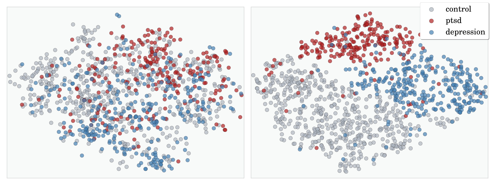

I am a postdoctoral fellow working with Professor <a href='https://www.cs.jhu.edu/~mdredze/' target="_blank">Mark Dredze</a> at the <a href='https://www.clsp.jhu.edu/' target="_blank">Center for Language and Speech Processing</a> at <a href='https://www.jhu.edu/' target="_blank">Johns Hopkins University</a>.

## Research 

<!-- <a href='' target="_blank"> M </a> -->

My research involves developing NLP and machine learning models for inferences over social media --- I am particularly interested in how to build these models in low-resource settings. I am also interested in using machine learning and data science for applications with a positive personal, social or humanitarian impact. 

My work has been driven by real-world problems with an emphasis on applications for public health research and the social sciences. 

<!-- **Social Sciences** -->
**Social Sciences**

I developed Twitter sentiment analysis models for journalists to gauge [public reactions](https://www.publico.pt/2012/11/03/politica/noticia/vergonha-foi-a-palavra-mais-escrita-no-facebook-de-passos-coelho-1569883){:target="_blank"} to newsworthy events. I also developed models for a political opinion mining system to track the popularity and attitudes about Portuguese politicians on social media, over time. The indicators produced by the system were aligned with traditional polling data and published daily on the [POPSTAR](http://www.popstar.pt){:target="_blank"} website. These indicators have been used by political scientists, such as [Pedro Magalhães](http://www.pedro-magalhaes.org/){:target="_blank"} and others, for [analyses](http://www.popstar.pt/wp/){:target="_blank"} into public opinion.

I developed [*User2Vec*](https://github.com/samiroid/usr2vec){:target="_blank"}, a tool to infer neural embeddings (i.e. learned vector representations) of users, given their social media posts. The resulting user vectors capture latent personal traits, which can provide context to model highly subjective and ambiguous content, e.g. I used them in a deep neural network for [sarcasm detection](https://techcrunch.com/2016/08/04/this-neural-network-tries-to-tell-if-youre-being-sarcastic-online/) on Twitter.

<!-- **Public Health** -->
**Public Health**

I also used *User2Vec* embeddings to build models that estimate the likelihood of a person being affected by a mental illness, such as depression or PTSD, given their Twitter data.

<!-- Currently, I am applying these models to build digital epidemiology systems to support real-time and longitudinal large-scale public health studies from social media data with strong emphasis on behavioral health. My hope is that this work will foster a better understanding of behavioral disorders and how they affect different segments of the population, thereby improving clinical practices; enable more responsive and deliberate public health interventions; and ultimately bring about a platform for [precision public health](https://blogs.cdc.gov/genomics/2018/05/15/precision-public-health-2/){:target="_blank"}. -->

Currently, I am investigating how to harness these methods to improve clinical and public health practices. One research thread that I am actively pursuing, is how to build digital epidemiology systems to support large-scale, longitudinal and real-time studies over social media. Specifically, I am building systems to investigate behavioral disorders and how they affect different segments of the population, particularly underpresented groups. More broadly, I hope this research contributes to increase our knowledge of complex and poorly understood illnesses and ultimately bring about a platform for [precision public health](https://blogs.cdc.gov/genomics/2018/05/15/precision-public-health-2/){:target="_blank"}, thereby enabling more responsive and deliberate health interventions. 

**Keywords**

Social Media Analysis | Natural Language Processing | Machine Learning | 
Neural Networks | Deep Learning | Low-resource Learning |
Computational Social Sciences | Mental-health Applications | Digital Epidemiology 

## Previous Positions
- Research Assistant @ [Northeastern NLP lab](https://nlp.khoury.northeastern.edu/){:target="_blank"}
- Visiting Researcher @ [UTA iSchool](https://www.ischool.utexas.edu/){:target="_blank"}
- Research Assistant @ [INESC-ID Lisboa](https://www.inesc-id.pt/){:target="_blank"}
- Junior Research Assistant @ [LaSIGE](https://ciencias.ulisboa.pt/en/lasige-large-scale-informatics-systems-laboratory){:target="_blank"}

## Industry 

- Research Scientist @ [Good Analytics](http://goodanalytics.io/){:target="_blank"}
- Research Scientist @ [Qntfy](https://www.qntfy.com/){:target="_blank"}

## Education

- PhD in Information Systems and Computer Engineering @ <a href='https://tecnico.ulisboa.pt/'>Instituto Superior Técnico</a>, <a href='https://www.ulisboa.pt/'>Universidade de Lisboa</a>  
Thesis: *Agile Social Media Analysis with Neural Networks* 

- Master in Software Engineering @ <a href='https://ciencias.ulisboa.pt/'>Faculdade de Ciências</a>, Universidade de Lisboa  
Thesis: *Desenvolvimento e Reengenharia de Aplicações Web de Suporte ao Negócio e Integração com Sistemas de Business Intelligence* 

- Licenciate in Computer Science @ Faculdade de Ciências, Universidade de Lisboa

